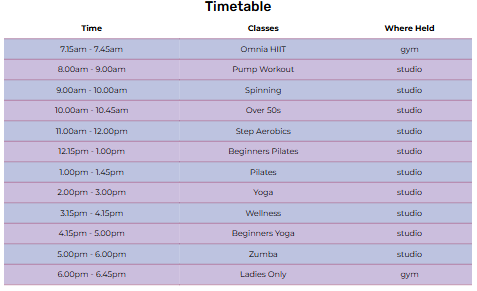

# Always Healthy Website

[View our deployed site here.](https://diane-4p.github.io/always-healthy/)

## Introduction

Always Healthy encourages new users to visit the gym and join to get healthy on a physical and spiritual level. It targets not only the young and professional to join the gym to use the equipment but also encourages the mature and elderly to do Yoga, Pilates and meditation, for the well being of the people who attend the gym.

There is no membership for the gym but we do offer a monthly fee for clients to be able to use all the services that are available. We also offer one off daily use standard fee and concessions for the budget conscious clients.

## User Experience (UX)

### Gym Owners Goals

Is interested in attracting new users to join the gym and to continue to use the facilities and also encourage and retain current gym clients. Also, the client wants to encourage senior citizens to join the gym looking for low-impact exercises for mobility, strength and balance.

### User Stories

- As a visitor to the gym I want to know when the gym is open so that I know when I can use the gym.
- As a first time user of the website I want to know what the membership and joining fees are so that I can compare them to other gyms.
- As a pensioner I want a place that is friendly and does exercise suited to my age and that is affordable.
- As a first time visitor to the gym I will need to be shown the facilities and how to use the equipment.
- As a middle aged woman I want a place to go where I don't feel intimidated when I exercise and ladies only events.
- As a mew user of the site I want to be able to see what other people say about the gym.
- As a user of the site I want to know what classes are available and book them.

## Design Choices

### Colour

The colours chosen were obtained from a sample of the blue on the Home page hero image and put into a pallet picker from mycolor.space and I chose the matching gradient pallet. These were converted into RGB by using Rapid Tables for transparency and to obtain the names for the colours I used colornamer.robertcooper.me (Shiva Blue rgb(148, 216, 251),Electric Eel rgb(140,188, 237), Portage rgb(143, 158, 217), Lavender Purple rgb(151, 126, 187), Bermuda Onion rgb(155, 95, 150), and Dynamo rgb(151, 64, 106))

### Typography

The Montserrat was used for the main font on the website with Sans-serif as its fallback font, just in case the main font does not get imported to the website correctly. Montserrat is used frequently in programming due to its clean look. The headings had the Rubik font for a different look, which also has the Sans-serif as the fallback font. For the logo the Rouge Script was used for its decorative properties, with the Serif font as its fallback.

### Imagery

The main image on the Home page is a photo of Worcester's Cathedral and as a land mark of the town it shows the city the gym is located in.

## Wireframes
- Hand drawn
- Computer produced

## Features

Each page has a **header** with the responsive **logo**, linking to the Home page, in the top left hand corner and a responsive **navigation bar**, linking to all the pages on the website (Home, Classes, Shop, Contact) to the top right. The navigation bar is fixed in position and when you hover over the page titles a line appears underneath, also the page that is active has a fixed line so that users can see which page they are on. The **footer** includes the **social media icons** of **Facebook, Twitter and Instagram,** linking them to their respective home pages. The footer also includes the **copyright information** and the **registered address** of the company. All buttons on each page change colour when you **hover** over them to click the link or send infomation to the gym.

### Home

The Home page features a **hero image** of the **Worcester Cathedral** with a text overlay with the text *Always Healthy, Keeping healthy in Worcester, Come and join us in an atmosphere that will keep you fit and healthy* to encourage users to join the gym. The overlay has a transparent background so the the view of the Cathedral is still visible, but does not impose on the words to give maximum impact when landing on the page.

There is a welcome to the site with information on how to join, opening times and various payment methods. There are images of various people enjoying and using the gym, which shows that the gym is a happy enviroment for all age groups to exercise and become healthier. There are also **call to action buttons** guiding the user to go look at the classes that are available or to contact the gym if they wish to join a class or ask for more information.

### Classes

The Classes page features 10 images of the classes that are available, so that you can see from the photos and the description below what the class entails and whether it would be suitable for the young or mature members of the gym. There is also a **call to action button** below each description to join and book one of the classes. To help keep people informed of classes there is a timetable at the bottom of the page showing what time, the class and where the class is held, which was created using a **table** for uniformity and its 2 tone colours with transparency so that the colours didn't overwelm the writing. 

### Shop

The Shop page is laid out in columns with the image and a small description of the product and the price, to show that there is clothing, trainers, and drinks bottles available for new or recurring members of the gym, whether young or mature. On the mobile the design choice of 2 columns wide was to show more items on the smaller screen so that users would not get discouraged by seeing one product at a time.

### Contact

The Contact page features a **contact form**, which requests an enquirers first and last names, email address and phone number. You also have a box to put details of your message, whether its to join the club, join a class or ask questions for further details etc. There is also a **send button** at the bottom of the form. The form has a transparent backgroun so that you can see the full page image of a woman using the dumbbells. This image shows what the gym is like and to encourage users to join the gym.

## Features to Implement in the Future

- Set up social media pages for Facebook, Twitter and LinkIn to encourage more people to join.
- Add a checkout basket and to receive payments to the shop.
- Add testimonials to the Home page to let users see how other gym members are enjoying the gym.
- Add FAQ table with drop down answers to the Home page so users get answers to their questions quicker.
- Change the send button on the Contact page to have a pop-up to show the message has been received.
- Add GDPR compliant pop-up to approve of using personal data and to comply with data protection law.

## Technologies Used

### Languages
- HTML5
- CSS3

### Frameworks, Libraries and Programs used
- Bootstrap v5.3.3

    - Google fonts
    - Font Awsome
    - Git
    - GitHub
    - Balsamiq

## Testing
- W3C Markup validator (HTML)
- W3C CSS validator (CSS)
- Beautifier.io (formating code)
- Ensure functions correctly
- Identify potential bugs
- Use defined user stories for testing

- Table of tests
| Test description    | Expected outcome    | Actual outcome    | Test outcome    | Problem solution |

- Further testing
- Known bugs discovered

## Deployment

## Credits (references)
- Code
    Table
    - [Override stripes to change Bootstraps colours](https://stackoverflow.com/questions/20825211/bootstrap-table-striped-how-do-i-change-the-stripe-background-colour)

- Content
    Colours
    - [Colour pallet](https://mycolor.space/?hex=%2394D8FB&sub=1) mycolor.space
    - [Colour converter](https://www.rapidtables.com/convert/color/hex-to-rgb.html?hex=97406a) Rapid Tables
    - [Name of colours](https://colornamer.robertcooper.me/) colornamer.robertcooper.me
    
- Images (favicon)
- Media (photos)
- Tutorials
- Graphics

## Acknowledgements
- Mentor - Brian Macharia
- Inspiration for website
- Student care

## Disclaimer

This site and content are for educational purposes only.

## Additional feature to add
- Future features
- Final testing
- Final credits

