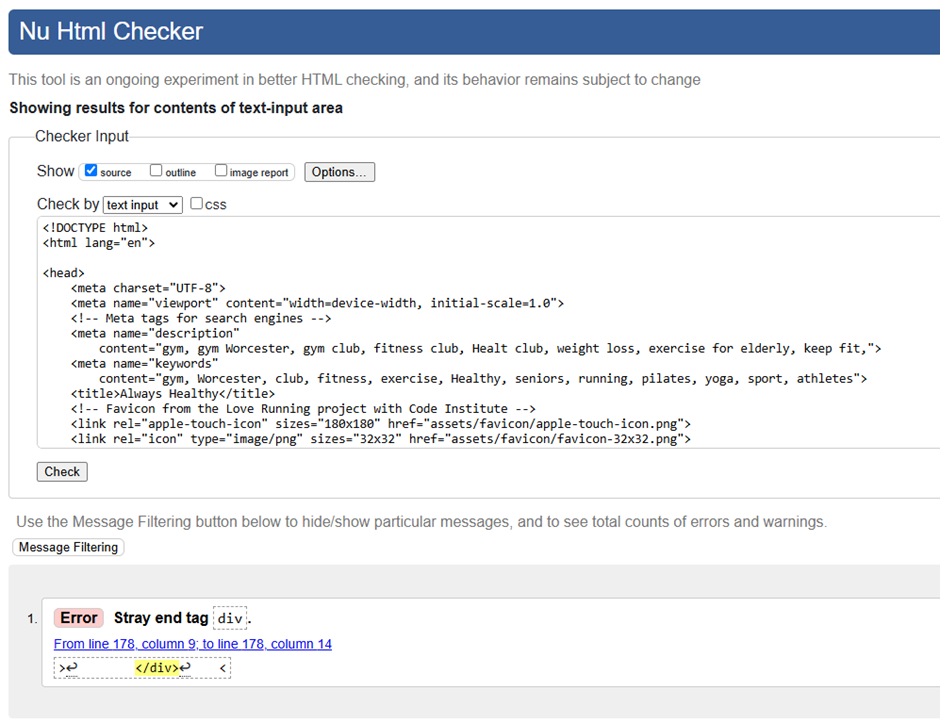
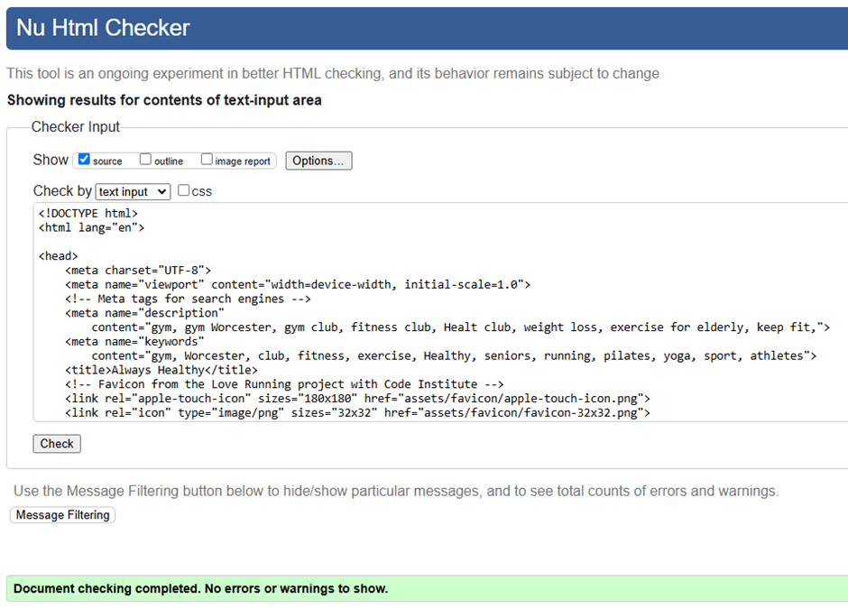
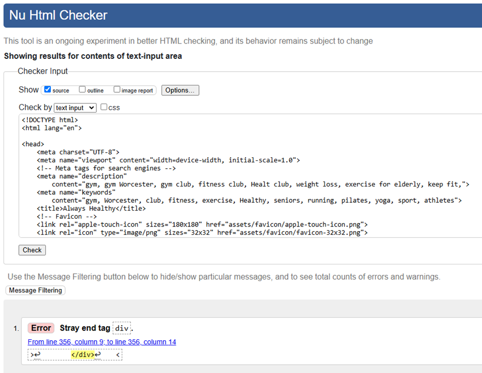
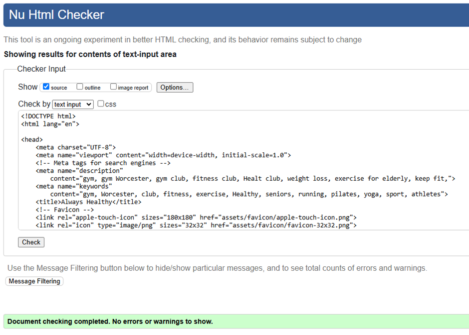
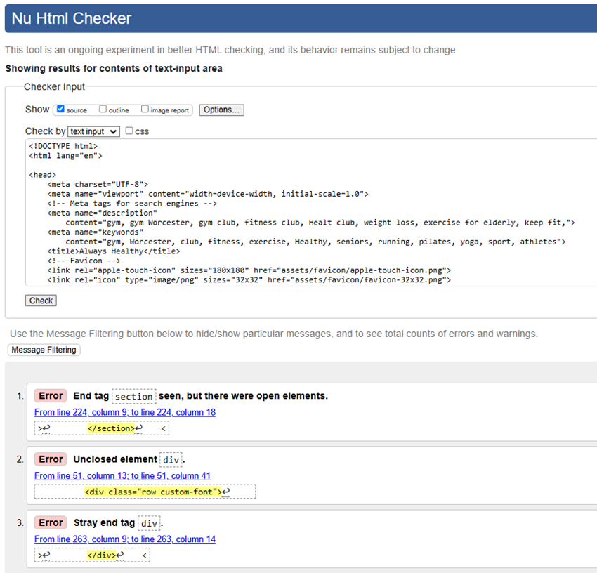
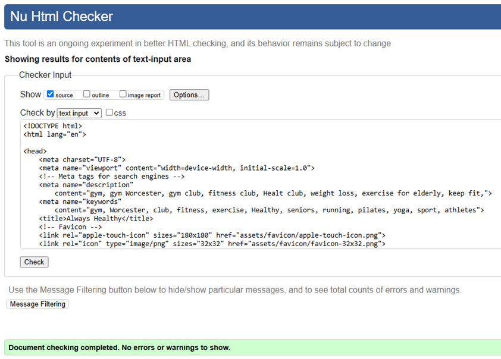
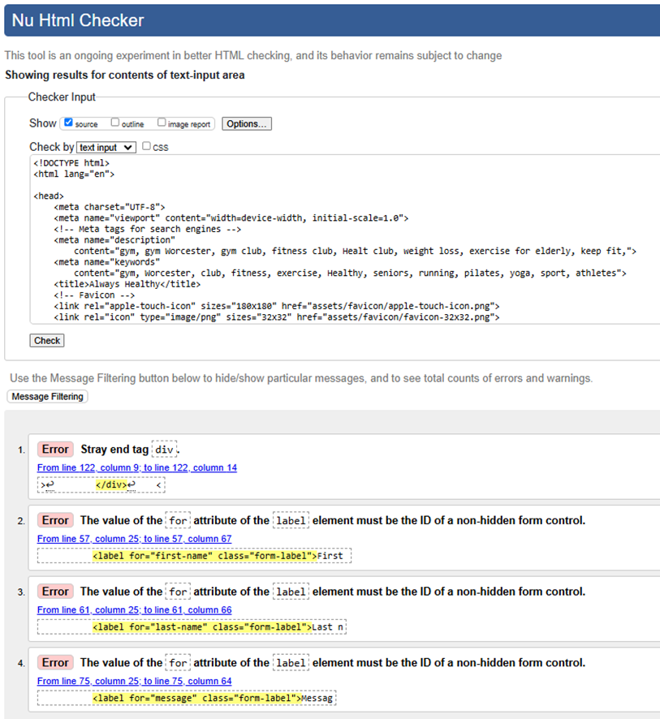
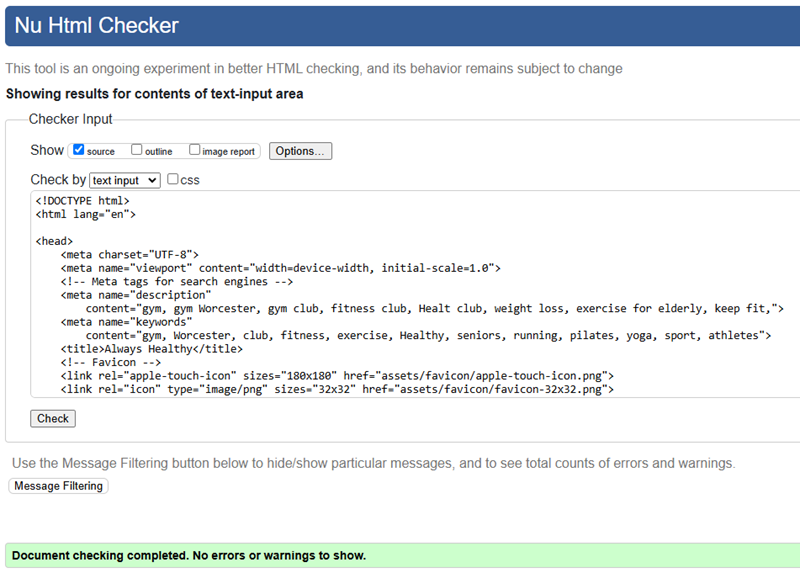
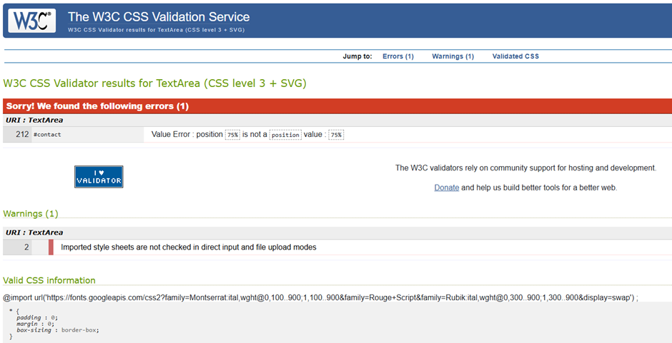
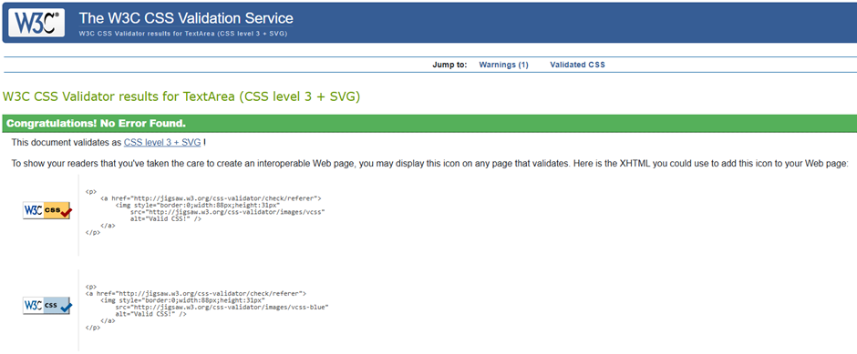

# Always Healthy Website - Testing details

[View README.md file](/README.md)

[View Always Healthy deployed site here.](https://diane-4p.github.io/always-healthy/)

## Testing

### Browsers

When opening the site in the browsers Chrome, Firefox and Edge, they all showed lagging in opening up onto the landing page. All 3 browsers also showed a white edge on the right hand side of the screen indicating the width was wider than the large viewports as the scroll bar appeared at the bottom and not on the smaller screens.

When I created a mochup of the website on **Am I Responsive**, the **Navbar** on the mobile appeared on 2 lines, which happens when the screen is less than 300px.

### Validators
- [W3C Markup validator](https://validator.w3.org/)
    - ### index.html
    - 
    - ### Once the error was corrected this was the result of the checker.
    - 
    - ### classes.html
    - 
    - ### Once the error was corrected this was the result of the checker.
    - 
    - ### shop.html
    - 
    - ### Once the errors was corrected this was the result of the checker.
    - 
    - ### contact.html
    - 
    - ### Once the errors was corrected this was the result of the checker.
    - 
- [W3C CSS validator](https://jigsaw.w3.org/css-validator/)
    - ### style.csss
    - 
    - ### The error was corrected but nothing was done about line 2 as it was an imported style sheet that couldn't be comfirmed by this checker and this was the result of the checker.
    - 

- Beautifier.io (formating code)
- Ensure functions correctly
- Identify potential bugs
- Use defined user stories for testing

- Table of tests
| Test description    | Expected outcome    | Actual outcome    | Test outcome    | Problem solution |

- Further testing
- Known bugs discovered