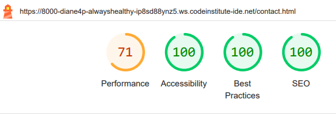
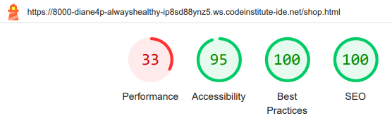

# Always Healthy Website - Testing details

[View README.md file](/README.md)

[View Always Healthy deployed site here.](https://diane-4p.github.io/always-healthy/)

## Testing

### Browsers

When opening the site in the browsers Chrome, Firefox and Edge, they all showed lagging in opening up onto the landing page. All 3 browsers also showed a white edge on the right hand side of the screen indicating the width was wider than the large viewports as the scroll bar appeared at the bottom and not on the smaller screens.

When I created a mochup of the website on **Am I Responsive**, the **Navbar** on the mobile appeared on 2 lines, which happens when the screen is less than 300px.

### Validators
- [W3C Markup validator](https://validator.w3.org/)
    - ### index.html
    - 
    - ### Once the error was corrected this was the result of the checker.
    - 
    - ### classes.html
    - 
    - ### Once the error was corrected this was the result of the checker.
    - 
    - ### shop.html
    - 
    - ### Once the errors was corrected this was the result of the checker.
    - 
    - ### contact.html
    - 
    - ### Once the errors was corrected this was the result of the checker.
    - 
- [W3C CSS validator](https://jigsaw.w3.org/css-validator/)
    - ### style.csss
    - 
    - ### The error was corrected but nothing was done about line 2 as it was an imported style sheet that couldn't be comfirmed by this checker and this was the result of the checker.
    - 

- ### Lighthouse

When looking at the performance, accessibility, best practices and the SEO of the website, I used **Lighthouse** in Google's development tools. The main downfall of the site is in it performance as the photos were not of the correct size in both height and width, in megabytes, and format. They also need to be more responsive over the different sizes of screens. This has caused lagging on the site when loading and linking to the other pages.
    - This still needs to be corrected.

There was also a small problem, on all the pages, with the ordering of the headings elements not being in a sequentially-descending order, but this has been rectified. On the shop there was another problem with the background and foreground colors not having a sufficient contrast ratio. When I looked at [Deque University's](https://dequeuniversity.com/rules/axe/4.10/color-contrast) site of color contrast for the colour I was using it came back with a blue colour, which was very bright and did not go with the colour design of my site, so I chose a colour from my pallet and I think that the contrast looks better than the blue they chose.

The results of the performance for the Home, Classes and Shop pages scored between 30-40 and the Contact page scored 71 for desktop but for the mobile it was 63. With accessability all of the pages scored 100 except for the Shop page with a score of 95 and with best practices and the SEO all pages got a score of 100. 

- Ensure functions correctly
- Identify potential bugs
- Use defined user stories for testing

- Table of tests
| Test description    | Expected outcome    | Actual outcome    | Test outcome    | Problem solution |

- Further testing
- Known bugs discovered